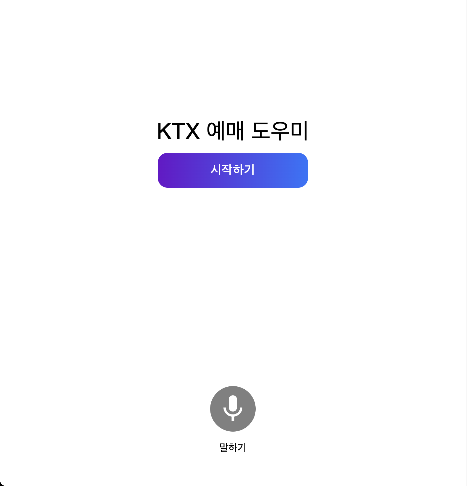

# 항해커톤
**일시** &nbsp; 2024.05.31(금) 20:00 ~ 2024.06.01(토) 18:00  
**팀명** &nbsp; 디브(디지털 브릿지)  
**팀원** &nbsp; 홍영의(팀장), 김초원, 박형인, 이소정  

### 1 문제 의식 🎯
- 사회적 문제: 디지털 약자들의 디지털 소외
  - 노인, 장애인 등이 기차 표를 얻는 데 어려움을 겪는 상황

### 2 해결 방안 💡
- 서비스 제작: IT에 익숙하지 않은 노인이나 장애인도 쉽게 기차를 예매할 수 있도록 도움
  - LLM과 음성 인식 기술을 활용한 대화형 인터페이스
  - 예매 화면의 작은 글씨와 복잡한 메뉴 구조를 개선하여 디지털 격차를 해소하고자 함

### 3 화면 및 유저 플로우 💻
|메인 화면|GIF|
|:---:|:---:|
|||

1. 웹 사이트를 통해 화면 접속
2. 음성을 통한 안내 (안녕하세요. 어디에서 어디로 가는 열차를 찾으시나요? 아래의 마이크 버튼을 누르고 말씀해주세요.)
3. 안내에 따라 마이크 버튼을 누르며 **출발지, 도착지, 날짜, 시간**을 음성으로 입력
4. OpenAI Function Call을 바탕으로 알맞은 예매 시간 전달
5. 사용자 예매 확정 시 결제를 위한 페이지로 이동
6. Document AI를 바탕으로 카드 정보 읽어오기
7. 결제 API 요청 및 예매 완료

### 4 기술 스택 및 아키텍처 구조 🔑 

